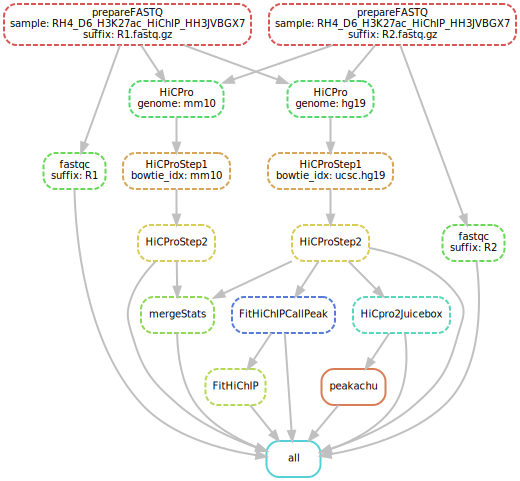
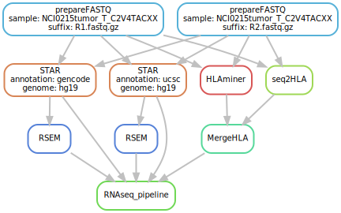
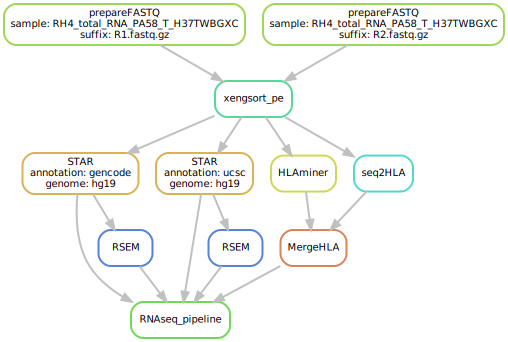

# khanlab_pipeline
This is the implementation of [KhanLab](https://ccr.cancer.gov/Genetics-Branch/javed-khan) NGS Pipeline using Snakemake.

Khanlab pipeline supports the following NGS data types:

1. [HiC](#headHiC)
2. [RNAseq](#headRNAseq)
3. [ChIPseq](#headChIPseq)
4. DNAseq

## Installation

The easiest way to get this pipeline is to clone the repository.

```
git clone git@github.com:hsienchao/khanlab_pipeline.git
```
This pipeline is available on NIH biowulf cluster, contact me if you would like to do a test run. The data from this pipeline could directly be ported in [OncoGenomics-DB](https://clinomics.ncifcrf.gov/production/public/), an application created to visualize NGS data available to NIH users.
## Requirements
[snakemake 5.13.0](https://snakemake.readthedocs.io/en/stable/)  
[mutt](http://www.mutt.org/)  
[gnu parallel](http://www.gnu.org/software/parallel/)  
SLURM resource management

### HiC:
- [HiCPro] (https://github.com/nservant/HiC-Pro)
- [JuiceBox] (https://github.com/aidenlab/Juicebox)
- [Bowtie2] (https://github.com/BenLangmead/bowtie2)

### ChIPseq:
- BWA
- macs
- rose
- homer
- coltron
- samtools
- bedtools

### RNAseq:
- STAR
- RSEM
- samtools
- xengsort
- HLAminer
- seq2HLA

## Conventions

- Sample names cannot have "/" or "." in them
- Fastq files end in ".fastq.gz"

## Running pipeline

#### Input sample sheet

- Sample sheet in YAML format

##### Required columns

1. Genome (accepted values: hg19,hg38,mm10)
2. SampleFiles ( usually Sample_ + Library_ID + _ + FCID )
3. Other pipeline type specific columns

##### Example 

See examples in [HiC](#expHiC), [RNAseq](#expRNAseq) or [ChIPseq](#expChIPseq)

- Sample sheet in YAML format
- Sample sheet can be generated using script sampleToYaml.py. Usage:
```
python scripts/sampleToYaml.py -s [SAMPLE_ID] -o [OUTPUT_FILE]
```
Example:
```
python scripts/sampleToYaml.py -s RH4_Ent6_H3K27ac_HiChIP_HH3JVBGX7 -o RH4_Ent6_H3K27ac_HiChIP_HH3JVBGX7.hic.yaml
```

#### Launching the pipeline

##### 1. General launch script:

    launch [options]
	
    required options:

            -type|t         <string>        Pipeline type (available options: hic,chipseq,ranseq,dnaseq)
            -workdir|w      <string>        Working directory where all the results will be stored.
            -sheet|s        <string>        Sample sheet in YAML format

    optional options: 
            -datadir|d <string> FASTQ file location (default: /data/khanlab/projects/DATA) 
            -dryrun Dryrun only 
            -dag Generate DAG SVG

  * Example
```
      launch -type hic -w /data/khanlab/projects/HiC/processed_DATA -s /data/khanlab/projects/HiC/processed_DATA/sample_sheets/RH4_D6_H3K27ac_HiChIP_HKJ22BGX7.hic.yaml
```
#####  2. Launch by sample ID (Khanlab automation and regular Khanlab users):
```
    scripts/automate.sh [sampleID]
```    
    This script will parse the Khanlab master files to determine the sequencing type automatically. Then it will retrieve required columns from HiC/ChIPseq sample sheets and check if FASTQ files are ready. Then it will lauch the pipeline automatically.
    
    The Khanlab data location:
    
    -- FASTQ files: /data/khanlab/projects/DATA
    -- Processed data: /data/khanlab/projects/pipeline_production/processed_DATA
    -- Processed data: /data/khanlab/projects/pipeline_production/sample_sheets


  * Example 1: process HiC sample
```
   scripts/automate.sh RH4_Ent6_H3K27ac_HiChIP_HH3JVBGX7
```
  * Example 2: process ChIPseq samples
```
   scripts/automate.sh RH4_D6_BRD4_024_C_HLFMLBGX3
```
  * Example 3: process RNAseq samples
```
   scripts/automate.sh NCI0215tumor_T_C2V4TACXX
```

## <a name="headHiC"></a>HiC

#### HiC sample_sheet

##### columns

1. Genome (hg19,hg38,mm10)
2. SampleFiles
3. SpikeIn (optional)
4. SpikeInGenome (optional)

#### <a name="expHiC"></a>HiC Example:
```
samples:
  RH4_D6_H3K27ac_HiChIP_HKJ22BGX7:
    Genome: hg19
    SampleFiles: Sample_RH4_D6_H3K27ac_HiChIP_HKJ22BGX7
    SpikeIn: 'yes'
    SpikeInGenome: mm10
```
#### Output
1. Juicebox hic file: [output dir]/[sample_id].allValidPairs.hic
2. HiCpro pairs:
  * Pairs for the reference genome:
    * [output dir]/HiCproOUTPUT/hic_results/data/[sample_id]/[sample_id]/[sample_id].allValidPair
  * Pairs for the spikeIn genome:
    * [output dir]/HiCproAQuAOUTPUT/hic_results/data/[sample_id]/[sample_id]/[sample_id].allValidPair
  * Mergestat summary (reference and spike-In):
    * mergeStats.txt
  * Successful flag:
    * successful.txt

#### Dependency graph

##### DAG example with spike-In


## <a name="headChIPSeq"></a>ChIPseq
#### ChIPseq sample_sheet

##### Required columns

1. Genome (hg19,hg38,mm10)
2. SampleFiles
3. SpikeIn (yes,no)
4. SpikeInGenome         (optional)
5. LibrarySize           (optional)
6. EnhancePipe (yes, no)
7. PeakCalling (narrow, broad)
8. PairedRNA_SAMPLE_ID   (optional)

## <a name="expChIPseq"></a>ChIPseq Example:

### ChIPSeq with enhancer pipeline (e.g. H3K27ac)

```
samples:
  RH4_D6_H3K27ac_018_C_HWC77BGXY:
    PairedInput: RH4_Input_001_C_H5TLGBGXX
    Genome: hg38
    SampleFiles: Sample_RH4_D6_H3K27ac_018_C_HWC77BGXY
    SpikeIn: 'yes'
    SpikeInGenome: dm6
    LibrarySize: 250
    EnhancePipe: 'yes'
    PeakCalling: narrow
    PairedRNA_SAMPLE_ID: Rh4_dmso_6h_rz_T_H3YCHBGXX

```

### ChIPSeq without enhancer pipeline (e.g. H3K27ac)

```
samples:
  RH4_D6_BRD4_024_C_HLFMLBGX3:
    PairedInput: RH4_Input_001_C_H5TLGBGXX
    Genome: hg38
    SampleFiles: Sample_RH4_D6_BRD4_024_C_HLFMLBGX3
    SpikeIn: 'yes'
    SpikeInGenome: dm6
    LibrarySize: 250
    EnhancePipe: 'no'
    PeakCalling: narrow
    PairedRNA_SAMPLE_ID: RH4_D6_T_HVNVFBGX2
```

#### Output

##### BWA Output

1. <strong>BAM</strong>: [sample_id].bam
2. <strong>No duplicate BAM</strong>: [sample_id].dd.bam
3. <strong>Bigwig/TDF</strong>: [sample_id].25.RPM.bw/tdf
4. <strong>SpikeIn normalized bigwig/TDF</strong>: [sample_id].25.scaled.bw/tdf

##### MACS2 Output

Folder name:

<strong>MACS_OUT_q_[cutoff]</strong>: MACS_Out_q_0.01 or MACS_Out_q_0.05

1. <strong>Peaks (no regions in blacklist)</strong>: [sample_id]_peaks.narrowPeak.nobl.bed
2. <strong>Peak annotation</strong>: [sample_id]_peaks.narrowPeak.nobl.bed.annotation.txt
3. <strong>Peak annotation summary</strong>: [sample_id]_peaks.narrowPeak.nobl.bed.annotation.summary
4. <strong>Peak summit file (narrow peaks only)</strong>: [sample_id].narrow_summits.bed
5. <strong>Peaks GREAT format</strong>: [sample_id]_peaks.narrowPeak.nobl.GREAT.bed

##### ROSE Output

Folder name:

<strong>MACS_OUT_q_[cutoff]/ROSE_out_[stitch distance]</strong>: MACS_Out_q_[cutoff]/ROSE_out_12500
 
1. <strong>All enhancers</strong>: [sample_id]_peaks_AllEnhancers.table.txt
2. <strong>Super enhancer BED file</strong>: [sample_id]_peaks_AllEnhancers.table.super.bed
3. <strong>Regular enhancer BED file</strong>: [sample_id]_peaks_AllEnhancers.table.regular.bed
4. <strong>Super enhancer summit file</strong>: [sample_id].super_summits.bed
5. <strong>Regular enhancer summit file</strong>: [sample_id].regular_summits.bed

##### Motif Output

We use homer to predict motifs for:

1. <strong>Peaks summit file</strong> (folder: motif_narrow)
2. <strong>Super enhancer summit file</strong> (folder: motif_super)
3. <strong>Regular enhancer summit file</strong> (folder: motif_regular)

##### EDEN output

We use EDEN to look for regulated genes in the same TAD for:

1. <strong>Peaks summit file</strong> (folder: motif_narrow)
2. <strong>Super enhancer summit file</strong> (folder: motif_super)
3. <strong>Regular enhancer summit file</strong> (folder: motif_regular)

In the same folder, EDEN generates the following files:

1. <strong>*_TPM[cutoff]_muti-genes.txt</strong>: Nearest genes for upstream, downstream and overlapped region of interest (TPM at least cutoff)
2. <strong>*_TPM[cutoff]_max-genes.txt</strong>: Max expressed gene around region of interest (TPM at least cutoff)
3. <strong>*_TPM[cutoff]_nearest-genes.txt</strong>: Max expressed gene around region of interest (TPM at least cuotff)
4. <strong>*_TPM[cutoff]_300k.superloci.max.bed</strong>: Max expressed gene around stitched regions (TPM at least cutoff)
5. <strong>*_TPM[cutoff]_300k.superloci.nearest.bed</strong>: Nearest gene around stitched regions (TPM at least cutoff)

##### Coltron output

Coltron output can be found in <strong>ROSE_out_12500/coltron</strong>

#### Dependency graph

##### DAG example with enhancer pipeline


##### DAG example without enhancer pipeline


## <a name="headRNAseq"></a>RNAseq

#### RNAseq sample_sheet

##### Required columns

1. Genome (hg19,hg38,mm10)
2. SampleFiles
3. SampleCaptures (polya, polya_stranded, ribozero, access)
4. Xenograft       (optional)
5. XenograftGenome (optional)

## <a name="expRNAseq"></a>RNAseq Example:

### Regular RNAseq

```
samples:
  NCI0215tumor_T_C2V4TACXX:
    Genome: hg19
    SampleFiles: Sample_NCI0215tumor_T_C2V4TACXX
    SampleCaptures: ribozero
```

### Xenograft RNAseq

```
samples:
  RH4_total_RNA_PA58_T_H37TWBGXC:
    Genome: hg19
    SampleFiles: Sample_RH4_total_RNA_PA58_T_H37TWBGXC
    Xenograft: 'yes'
    XenograftGenome: mm10
    SampleCaptures: ribozero
```

#### Output

##### STAR Output

1. <strong>Gencode STAR BAM</strong>: STAR_hg19_gencode/[sample_id].star.genome.bam
2. <strong>Gencode STAR BAM bigwig</strong>: STAR_hg19_gencode/[sample_id].star.genome.bw
3. <strong>UCSC STAR BAM</strong>: STAR_hg19_gencode/[sample_id].star.genome.bam
4. <strong>UCSC STAR BAM</strong>: STAR_hg19_gencode/[sample_id].star.genome.bw

##### RSEM Output

1. <strong>Gencode RSME genes</strong>: RSEM_hg19_gencode/[sample_id].hg19.genocde.genes.results
2. <strong>Gencode RSME isoforms</strong>: RSEM_hg19_gencode/[sample_id].hg19.genocde.isoforms.results
3. <strong>Gencode RSME genes</strong>: RSEM_hg19_ucsc/[sample_id].hg19.ucsc.genes.results
4. <strong>Gencode RSME isoforms</strong>: RSEM_hg19_ucsc/[sample_id].hg19.ucsc.genes.results

##### HLA Output

1. <strong>Seq2HLA and HLAminer combined file</strong>: HLA/[sample_id].Calls.txt

##### Xenograft filtered FASTQ (for Xenograft samples)

1. <strong>DATA/classification.tsv: Filtering summary</strong>
2. <strong>DATA/[sample_id].filtered_R1.fastq.gz</strong>
3. <strong>DATA/[sample_id].filtered_R2.fastq.gz</strong>

#### Dependency graph

##### DAG example


##### DAG example for Xenograft samples


### DNAseq
Not implemented yet.

### Methylseq
Not implemented yet.

For questions or comments, please contact: Hsien-chao Chou (chouh@nih.gov)